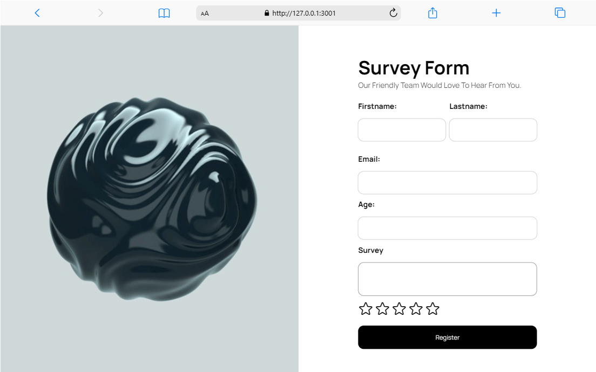

# User Registration Form

## Description

This project is a simple user registration form with client-side validation using HTML, CSS, and JavaScript.




## Features
- Username, email, and password fields
- Real-time validation
- User-friendly error messages
- Success message on valid submission

## Features
- Username, email, and password fields
- Real-time validation
- User-friendly error messages
- Success message on valid submission

## Technologies Used
- HTML
- CSS
- JavaScript

## Installation
1. Clone the repository using 
```
https://github.com/Muen1/Survey-Form-Summative.git
```

## Mobile Responsiveness


